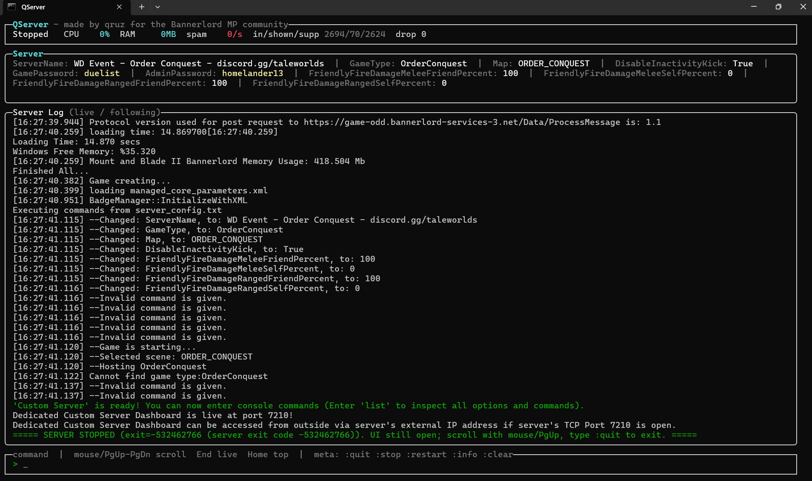

# QServer

**A better console for the Mount & Blade II: Bannerlord dedicated server.**


> made by **qruz** — for the Bannerlord MP community

The stock Bannerlord dedicated-server console dumps *everything* — XML loading, missing-DLL noise, per-second
keepalive lines — with no rate limiting. Worse, any client can spam unknown network messages and flood the console,
driving CPU up. **QServer** runs the real server hidden in the background and puts a clean, scrollable terminal
UI in front of it: it hides startup spam, throttles runtime spam, keeps a filtered log, and lets you type server
commands — all driven by a simple JSON config.



---

## Features

- **Clean console** — hide classic startup spam and throttle runtime spam (e.g. `Handler not found for network message`,
  `AliveMessage`) to at most once per interval, with a `(xN)` summary. Typically a **~95% reduction** in visible lines.
- **Scrollable log** — mouse wheel / PgUp / PgDn / Home / End. Scrolling freezes the view; new lines never yank you
  to the bottom until you press **End**.
- **Send commands** — a real command line (`list`, `stats`, `mp_admin.kick_player <name>`, `ServerName <value>`, …)
  plus meta-commands (`:stop`, `:restart`, `:clear`, `:quit`).
- **Live "Server" panel** — a persistent side panel that shows the settings the server reports (ServerName,
  GameType, Map, MaxNumberOfPlayers, GamePassword, AdminPassword, …), captured straight from the console.
- **Config-driven** — every rule and setting lives in `qserver.json`. No recompiling to tune noise.
- **Watchdog** — optional auto-restart with exponential backoff and a crash-loop guard.
- **Stays up** — when the server exits, the UI stays open so you can read the tail; close it when *you* want.
- **Live status** — server state, CPU%, RAM, spam-rate meter, and line counters.

---

## Requirements

- Windows (x64).
- [.NET 8 runtime](https://dotnet.microsoft.com/download/dotnet/8.0) (or use a self-contained release build).
- A Mount & Blade II: Bannerlord **dedicated server** install.

> ⚠️ The console-capture layer uses the Win32 Console API (`AttachConsole` / `ReadConsoleOutput`), so QServer
> is **Windows-only** for now.

---

## Quick start

### From a release

1. Download a release and unzip it.
2. Open `qserver.json` and set `server.exePath`, `server.args` and `server.workingDirectory` to match your
   server (or set `server.argsFromBat` to your existing `start.bat`).
3. **Double-click `start.bat`** (or run `QServer.exe` from Windows Terminal / cmd). Use a real terminal — the
   UI is interactive.

### From source

```powershell
git clone https://github.com/bolt4dev/QServer.git
cd QServer
dotnet build QServer.sln -c Release

# produce a ready-to-run folder in .\dist
.\publish.ps1                 # framework-dependent
.\publish.ps1 -SelfContained  # bundles the .NET runtime
```

---

## Configuration

Config lives in `qserver.json` next to the executable. Generate a fully-commented default any time:

```powershell
QServer.exe --write-config qserver.json
```

| Section    | Key                     | Meaning |
|------------|-------------------------|---------|
| `server`   | `exePath` / `args` / `workingDirectory` | The server executable and its command line. |
| `server`   | `argsFromBat`           | Optional path to a launch `.bat`; parsed into the three fields above. |
| `server`   | `readySentinel`         | Console text that marks the server as ready. |
| `server`   | `startupWarnSeconds`    | Warn in the UI if the ready sentinel hasn't appeared after this many seconds. Default `90`. |
| `server`   | `killOrphansOnStart`    | Kill leftover server/scraper processes (same exe paths) from a previous run before starting. Default `true`. |
| `server`   | `singleInstance`        | Refuse to start a second panel for the same server exe (named-mutex guard). Default `true`. |
| `scraper`  | `pollMs`, `readbackLines`, `bufferWidth`, `bufferHeight` | Console-capture tuning. |
| `scraper`  | `hideServerWindow`      | Hide the server's console window (recommended). |
| `scraper`  | `hideDelayMs`           | Earliest ms after spawn the server window may be hidden (also gated on first output). Default `1500`. |
| `scraper`  | `attachTimeoutMs`       | Console-attach retry budget before the scraper gives up and kills the server (was a hard-coded 3s). Default `15000`. |
| `ui`       | `refreshMs`, `scrollbackLines`, `wheelScrollLines`, `showSplash`, `showServerInfo` | Terminal UI behaviour and the Server strip. |
| `restart`  | `enabled`, `initialDelaySeconds`, `maxDelaySeconds`, `multiplier`, `maxRestartsPerWindow`, `restartWindowMinutes` | Watchdog / auto-restart with backoff and a crash-loop guard. |
| `restart`  | `rebindGraceSeconds`    | Wait after the old server is confirmed dead before starting the next, so the OS releases the UDP port / the lobby drops the old session. Default `2`. |
| `noise`    | `rules`, `duplicateCollapse`, `defaultThrottleSeconds`, `spamMeterWindowSeconds` | The heart of it — see below. |
| `logging`  | `enabled`, `path`, `maxFileSizeMb`, `retainedFiles` | QServer's filtered log. |
| `logging`  | `hostLogPath`           | Lifecycle log — spawn/attach/ready/exit/kill evidence, separate from the filtered log above. Default `logs/host.log`. |

> The default rules keep `AdminPassword`/`GamePassword` **out of** the log file (they still appear in the live
> Server strip). Run `--write-config` to see every key with comments.

### Noise rules

Rules are evaluated top to bottom; the **first match wins**. `match` is a regex tested against each line *after* its
`[HH:MM:SS.fff]` timestamp is stripped.

| `action`    | Effect |
|-------------|--------|
| `hide`      | Never shown on screen and not written to QServer's log. |
| `throttle`  | Shown at most once per `throttleSeconds`; the count in between is summarized as `(xN)`. |
| `collapse`  | Consecutive identical lines are folded into one with a counter. |
| `highlight` | Shown, emphasized (colour from `severity`). |
| `pass`      | Shown as-is. |

```jsonc
{ "match": "Handler not found for network message", "action": "throttle", "throttleSeconds": 5, "meter": "spam" },
{ "match": "^Loading xml file:", "action": "hide" },
{ "match": "is ready! You can now enter console commands", "action": "highlight" }
```

> The server keeps its **own** full raw log, so `hide` and `throttle` don't lose anything — QServer's log is
> simply the clean, filtered view.

---

## In-app commands

| Input | Action |
|-------|--------|
| any text | Sent to the server as a console command |
| `:stop` | Stop the server (disables auto-restart for this stop) |
| `:restart` | Restart the server now |
| `:info` | Toggle the "Server" settings strip |
| `:clear` | Clear the on-screen log |
| `:quit` / `:q` / `Esc` | Close QServer |
| ↑ / ↓ | Command history |
| Mouse wheel · PgUp / PgDn | Scroll |
| Home / End | Jump to top / back to the live stream |

Command-line flags: `--about` / `--version`, `--write-config <path>`, `--replay <file>`, `--synthetic`,
`--show-server`, `--run-sec <n>`.

---

## How it works

Bannerlord's dedicated server writes to its **own Win32 console screen buffer** (`CONOUT$`) and reads commands from
`CONIN$` — it does **not** use the redirectable stdout/stdin streams, and it crashes without a console. So a plain
`RedirectStandardOutput` captures nothing, and a windowless ConPTY makes it allocate its own console. The working
approach is to attach to the server's console and read/write it directly. Because a process can attach to only one
console (and only a **parent** can attach to a child's), QServer is three processes:

```
QServer.exe          (A) the TUI you interact with
      │  launches
      ▼
QServer.Scraper.exe  (C) launches the server, AttachConsole()s it,
      │                        reads its screen buffer, injects your commands
      ▼
Server (Starter.exe)       (B) the real dedicated server, hidden console
```

`A` and `C` talk over stdin/stdout pipes; `C` mirrors the server console up to `A`, which runs the noise pipeline and
renders the TUI.

### Lifecycle guarantees

Three processes must never turn into two orphans. Each parent puts its child in a Windows **Job Object** created with
`JOB_OBJECT_LIMIT_KILL_ON_JOB_CLOSE`, forming a chain:

```
A (panel) ──job──▶ C (scraper) ──job──▶ B (server)
```

When a process exits **for any reason** — window **X**, `Ctrl+C`, a crash, Task Manager *End Task*, or an RDP
logoff — the OS closes its handles, and the kernel terminates every member of its job. So **closing the panel any
way kills the scraper, and the scraper's own job kills the real server.** The guarantee is kernel-enforced and needs
no cooperation from the dying process.

On top of that hard floor, cooperative layers make shutdown **orderly and logged** rather than abrupt: a console
control handler runs cleanup inside the OS grace window on window-close / logoff / shutdown (kills the child tree and
flushes logs), routes `Ctrl+C` to a graceful UI quit, and the scraper independently watches the panel and kills the
server on every abnormal path.

At **startup** the panel ends the old "close-and-reopen once or twice" flakiness caused by leftover orphans holding the
UDP port / lobby session:

- **Orphan sweep** (`server.killOrphansOnStart`) — kills leftover server/scraper processes from a previous run,
  matched by **full executable path**, so an unrelated server (or a panel pointed at a *different* install) is never
  touched.
- **Single instance** (`server.singleInstance`) — a named-mutex guard refuses a second panel for the same server exe.
  The duplicate check runs *before* the sweep, so a healthy running panel is never swept by a second launch.
- On restart, the panel confirms the old server is actually dead and waits `restart.rebindGraceSeconds` before the
  next start, so the replacement does not collide with the process it replaces.

Every lifecycle event — panel start, sweep kills, spawn/attach/ready/exit/kill — is appended to
**`logs/host.log`** (`logging.hostLogPath`), the evidence trail for "it sometimes fails to start" reports.

Two PowerShell scripts verify this: `tests/kill-matrix.ps1` asserts no server/scraper survives any way of closing the
panel, and `tests/rapid-cycle.ps1` runs back-to-back headless starts that must each reach the ready sentinel and leave
nothing behind. Because Windows Terminal hosts its own window, the literal **X**-button path is signed off with one
manual click on a classic console (and on the VDS).

### Project layout

```
src/QServer.Core/     portable core: config, noise pipeline, server-info, logging,
                            the IServerHost / IConsoleUi interfaces, and the AppEngine orchestrator
src/QServer.Tui/      Spectre.Console front-end  (implements IConsoleUi)
src/QServer.Scraper/  Windows console capture/inject helper exe  (Win32 interop)
src/QServer/          composition root: ScraperHost (implements IServerHost) + wiring
```

`QServer.Core` has **no UI and no Win32 dependency**. The seams are two interfaces:

- **Add a UI** (a different terminal renderer, a WPF window, a web dashboard, ...) → implement `IConsoleUi` and
  construct it in the composition root.
- **Support another OS** (e.g. a Linux dedicated server) → implement `IServerHost` with a suitable capture
  mechanism and pass a different host factory to `AppEngine`.

The engine, pipeline, config and rules are shared and unchanged in both cases.

---

## Limitations

- **Windows only** (Win32 console API).
- QServer relieves the console-render/stall cost of spam and gives you full control over what's shown, but it
  can't change the server's own per-packet cost or stop the engine's internal logging — it's a front-end, not a mod.
- Fully validating command injection and live-spam throttling needs a server that stays up; if your install is out of
  date it may exit early (`Disconnected from custom battle server manager`), which is unrelated to QServer.

---

## Support & contact

QServer is free and open source. If it saves you some hassle and you'd like to support development:

- ❤️ **Patreon** — [patreon.com/qruz](https://www.patreon.com/qruz)
- 💬 **Discord** — reach me at **96u2**

Bug reports and feature requests are best filed as [issues](https://github.com/bolt4dev/QServer/issues).

---

## Contributing

See [CONTRIBUTING.md](CONTRIBUTING.md). Bug reports, rule presets, and a Linux capture path are all welcome.

## License

[MIT](LICENSE) © 2026 qruz.

QServer is an independent community tool and is **not affiliated with or endorsed by TaleWorlds Entertainment**.
Mount & Blade II: Bannerlord is a trademark of TaleWorlds Entertainment.
